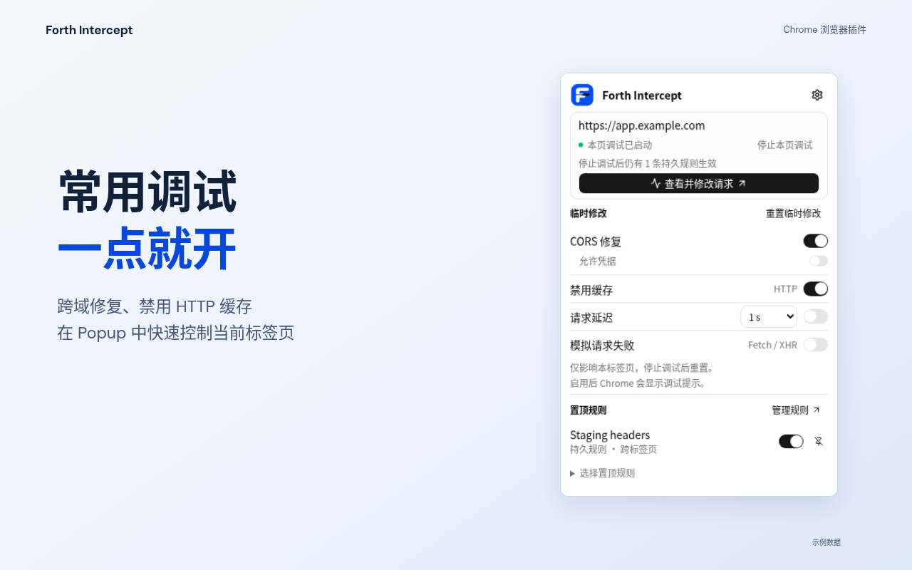

# Chrome Web Store marketing assets

These are the approved, straight-on Forth Intercept store images. They use the
actual Chrome extension UI with sample data, short benefit-led copy, and Goldie's
`classic` layout principles. The marquee uses a horizontal copy-and-window layout.



## Upload files

Upload the following five **1280 × 800** screenshots in this order for each
locale. Chrome Web Store accepts at most five screenshots per locale; use one
language set in each language slot, rather than uploading both together.

| Order | Benefit / actual screen                          | English                                         | 简体中文                                           |
| ----- | ------------------------------------------------ | ----------------------------------------------- | -------------------------------------------------- |
| 1     | Quick controls / Popup                           | [PNG](screenshots/en/01-popup-1280x800.png)     | [PNG](screenshots/zh-CN/01-popup-1280x800.png)     |
| 2     | Applied changes / request Inspector              | [PNG](screenshots/en/02-inspector-1280x800.png) | [PNG](screenshots/zh-CN/02-inspector-1280x800.png) |
| 3     | Local JSON responses / Mock editor               | [PNG](screenshots/en/03-mock-1280x800.png)      | [PNG](screenshots/zh-CN/03-mock-1280x800.png)      |
| 4     | Precise targeting / rule matching                | [PNG](screenshots/en/04-scope-1280x800.png)     | [PNG](screenshots/zh-CN/04-scope-1280x800.png)     |
| 5     | Loading-state testing / Popup with request delay | [PNG](screenshots/en/05-delay-1280x800.png)     | [PNG](screenshots/zh-CN/05-delay-1280x800.png)     |

| Promo file                                    | Store field                 | Pixels     |
| --------------------------------------------- | --------------------------- | ---------- |
| [Small promo tile](promo/product-440x280.png) | Required small promo tile   | 440 × 280  |
| [Marquee](promo/product-1400x560.png)         | Optional marquee promo tile | 1400 × 560 |

Each file is a 24-bit RGB PNG without transparency. Promo tiles are shared between
locales, so they use English. Headlines and short subheads have no trailing
periods in either language. Each screenshot presents one benefit and one complete,
upright product window. The gallery includes Popup twice in distinct states:
CORS repair + HTTP cache bypass, then a one-second Fetch / XHR delay.

Keep the existing extension icon; these images are store marketing assets.

Chrome's [image requirements](https://developer.chrome.com/docs/webstore/images/)
and [listing guide](https://developer.chrome.com/docs/webstore/cws-dashboard-listing)
were checked on 2026-10-09. Screenshots must show the product experience. The small
tile is required, the marquee is optional, and a listing accepts up to five
screenshots per locale. Review the current requirements before uploading.

## Goldie skill

The project-local skill is installed at
[`.agents/skills/goldie`](../../.agents/skills/goldie/SKILL.md), with its upstream
references and license. `skills-lock.json` records its source and content hash.
To reinstall it from the repository root:

```bash
npx skills add kacperkapusciak/goldie --skill goldie --agent codex --yes
```

Goldie's current CLI supports iPhone, iPad, and Pixel store formats, not Chrome
Web Store. For this project, borrow its short copy, soft brand backgrounds,
`classic` composition, and `screenOnly` treatment; use the Chrome-specific scripts
below instead of mobile simulators, phone frames, or Apple/Play dimensions.
This pipeline does not claim a Goldie CLI render or Apple/Play verification.

## Edit and regenerate

From the repository root, install the usual development dependencies first:

```bash
pnpm install --frozen-lockfile
```

The scripts use the extension's existing Playwright dependency. They use
`CHROMIUM_PATH` when set, otherwise `/usr/bin/chromium` when available, otherwise
Playwright's installed Chromium. Install the latter if needed:

```bash
pnpm --filter browser-cors-unlocker exec playwright install chromium
```

To change copy, screenshot order, or colors, edit [`source/design.json`](source/design.json).
Its `scenes` array defines capture names, layouts, and localized copy. To change
the desktop geometry, edit [`source/layout.html`](source/layout.html). Keep the
approved UI upright and completely inside the canvas, with a single window.
Then export from the saved original captures:

```bash
node marketing/chrome-web-store/source/export.mjs
```

To refresh the product UI after an extension change, build and recapture first:

```bash
pnpm --filter browser-cors-unlocker build:chrome
node marketing/chrome-web-store/source/capture.mjs
node marketing/chrome-web-store/source/export.mjs
```

Both scripts locate the repository relative to their own files; `FORTH_REPO` is an
optional override. They require no new extension permissions, production
dependencies, or global Goldie CLI installation.

The exporter checks five scenes per locale, unique filenames, period-free short
copy, exact dimensions, 24-bit RGB PNG headers, copy bounds,
unrotated UI, absence of perspective, the complete window's canvas bounds, and
separation between marketing copy and the UI window.
It writes checks and half-size inspection previews to ignored `qa/` files.
Review those previews before committing refreshed assets.

## Source and attribution

- `source/captures/` contains original production-UI renders and actual editor
  detail crops. Capture uses Chrome API fixtures with four example rules; it is
  not evidence of a real intercepted network session. Preserve **Sample data /
  示例数据** labeling. Example origins use `example.com` and contain no user data.
- The approved UI was captured from `oe/cors-unlocker` commit
  `f07914d07371a5cb61e3b5bc998901250344e80b`. The UI is rendered by the product's
  React code, not redrawn by an image model.
- Fonts come from [Goldie's bundled fonts](https://github.com/kacperkapusciak/goldie/tree/main/assets/fonts):
  DM Sans and Noto Sans SC. Their copyright notices and SIL Open Font License are
  in [`source/fonts/OFL.txt`](source/fonts/OFL.txt).
- The Noto Sans SC subsets cover the current marketing copy. If adding new
  Chinese characters, regenerate these subsets with `pyftsubset` from Goldie's
  original font files, or point `layout.html` at the original full fonts. Preserve
  the font license. Captured UI text already lives in the PNGs.
- Reference skill: [Goldie](https://github.com/kacperkapusciak/goldie),
  [SKILL.md](https://github.com/kacperkapusciak/goldie/blob/main/skills/goldie/SKILL.md),
  and its [configuration guide](https://github.com/kacperkapusciak/goldie/blob/main/skills/goldie/references/config.md).

This directory contains the approved Goldie-inspired version. Earlier logo-led
and tilted drafts are not included. Committing assets does not publish the store
listing.
